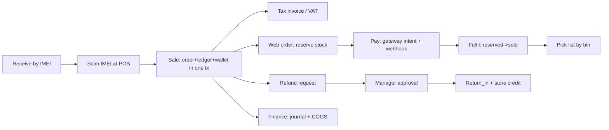

# OmniRetail OS — Product & Technical Master Document

> **Status:** Reverse-engineered audit, produced after 14 development phases.
> This is the **single source of truth** going forward. Where a topic already
> has a dedicated deep-dive, this document summarises and links rather than
> duplicating — the canonical files are cited inline.
>
> **Honesty conventions used throughout:**
> **[INFERRED]** — a requirement deduced from the implementation, never stated.
> **[IMPLICIT]** — a decision made during coding without explicit product justification.
> **[UNKNOWN]** — genuinely undetermined; needs a human decision.
> **[RISK]** — a weakness, inconsistency, or danger called out bluntly.

---

## 1. Executive Summary

OmniRetail OS is a multi-tenant SaaS retail operating system — POS, inventory,
e-commerce, order management, warehouse, finance, and marketplace sync on **one
centralized, ledger-based inventory database**. The beachhead is UAE/Dubai
mobile-phone and electronics retailers (serialized/IMEI stock, high fraud
exposure, thin margins).

**What is genuinely strong:** the domain core. Inventory is an append-only
ledger (double-entry style) with derived stock levels, giving provable
traceability, fraud resistance, and offline-sync correctness as *properties of
the data model* rather than bolted-on policy. Multi-tenant isolation is enforced
by PostgreSQL row-level security against a non-superuser role — verified live.
604→659 automated tests, most running against a real PostgreSQL, including a
tenant-isolation proof and a payment-webhook signature suite. It is deployed and
serving real data on Neon + Vercel.

**What is weak or unfinished (the honest part):**
- The **event relay and marketplace sync are not running in production** — they
  are queue-consumer processes that cannot live on serverless; domain events
  accumulate unrelayed. **[RISK-1, critical for the "omnichannel" promise]**
- The API is a **single 1,681-line `pgApp.ts` with 98 routes** — a real
  maintainability cliff. **[RISK-2]**
- Every marketplace connector (Noon, Salla, Zid) is a **tested-mapping /
  UNVERIFIED-endpoint skeleton** — no live integration exists or can, without
  vendor credentials that need a trade licence.
- Payment capture, email (magic links), and AI narration all run against
  **mock/stub providers** in production. The stub is deterministic and safe, but
  the deployed "AI daily digest" is not actually Claude.
- The in-memory rate limiter is **per-warm-container**, which on serverless
  means it barely limits anything. **[RISK-3]**
- Known exposed credentials (demo password, Neon owner password pasted in chat)
  and dev-wide-open CORS. **[RISK-4]**

**Maturity verdict:** a genuinely production-grade *core* wrapped in a
*demo-grade* deployment and *skeleton-grade* external integrations. It is an
excellent MVP foundation and an honest B2B demo; it is **not yet a live
production system a real Dubai shop could trade on end-to-end** — chiefly
because of no real payments, no running sync worker, and the operational gaps
below.

---

## 2. Product Overview

| Attribute | Value |
| --- | --- |
| **Product name** | OmniRetail OS |
| **Category** | Omnichannel Retail ERP / POS / Inventory SaaS (multi-tenant) |
| **One-liner** | One ledger-based inventory brain that runs a retailer's shop floor, warehouse, website, and marketplaces — with every stock movement traceable to a person and a device. |
| **Beachhead market** | UAE / Dubai mobile-phone & electronics retailers (Deira corridor archetype), then GCC, then general retail |
| **Deployment (current)** | API as Vercel serverless fn; admin/POS/storefront as static Vercel sites; Neon PostgreSQL 18 (ap-southeast-2); worker NOT deployed |
| **Repo** | pnpm + TypeScript monorepo, 13 packages (7 `packages/`, 6 `apps/`), 25 SQL migrations, 60 tables, ~659 tests |

Full narrative in [`01-executive-summary.md`](01-executive-summary.md).

**Product Vision.** Become the definitive retail operating system for
serialized-inventory retailers in the GCC — the system of record where a phone
is traceable from supplier PO to IMEI sale to warranty claim to trade-in, across
every channel, with accounting and fraud controls that are structural rather
than procedural.

**Product Mission.** Give a small-to-mid retailer the inventory accuracy,
audit trail, and omnichannel reach of an enterprise ERP, at SaaS cost, in
Arabic and English, without an implementation consultant.

**Value Proposition.** *Ledger-based inventory* — nothing changes stock without
an attributable, immutable movement — is simultaneously the accuracy story, the
audit story, the fraud-prevention story, and the offline-sync story. Competitors
bolt an audit log onto mutable quantity columns; here the audit *is* the data
model.

**Core Problem Statement.** Serialized-electronics retailers lose margin to
inventory drift, internal fraud (sweethearting, unrecorded discounts, silent
stock adjustments), and channel oversell, while horizontal ERPs handle IMEI/
warranty/repair poorly at POS speed and POS-SaaS products lack marketplace-grade
sync. No affordable product treats "every unit traceable, every action
attributable" as a first-class invariant for this segment in this region.

---

## 3. Problem & Opportunity

| Dimension | Detail |
| --- | --- |
| **Primary pain** | Inventory inaccuracy + internal fraud in serialized retail; oversell across channels; weak IMEI/warranty/repair handling |
| **Who feels it** | Independent & multi-store phone/electronics retailers; their owners (margin), managers (control), accountants (VAT/audit) |
| **Why now (UAE)** | 5% VAT + TRN invoicing mandate, coming e-invoicing (Peppol PINT-AE), Arabic/RTL expectation, Noon/Amazon.ae marketplace gravity, PDPL |
| **Existing alternatives** | Odoo/ERPNext (serialized POS weak, heavy), Lightspeed/Square (no deep IMEI/marketplace sync), Zoho Inventory (thin POS), Cin7 (price/complexity) — honest positioning in [`prd/01`](prd/01-product-requirements.md) |
| **Differentiation** | Ledger-as-truth; serialized-first (IMEI uniqueness + per-unit state machine); connector SDK; offline-first POS sharing the *same* domain code as the server |
| **Opportunity size** | [UNKNOWN] — no market sizing was ever done. Needs real TAM/SAM/SOM for GCC serialized retail before fundraising or GTM claims. |

---

## 4. Target Users & Personas

Nine personas are fully specified in
[`prd/02-personas-and-user-stories.md`](prd/02-personas-and-user-stories.md).
Condensed here with what the **built system actually serves today**:

| Persona | Served today? | Gap |
| --- | --- | --- |
| **Owner** (multi-store, margin-focused) | Partial — admin dashboard, analytics, finance reports, AI digest (stub) | No real cross-store consolidation UI; AI is stub in prod |
| **Store manager** (approvals, cash, staff) | Yes — approvals inbox, cash sessions, exception reports | No shift/staff scheduling; no CCTV correlation UI |
| **Cashier** (fast, offline) | Yes — POS web app, IMEI scan, all tenders, offline queue | Offline queue is localStorage v1, not the full pos-core SyncEngine; no hardware (drawer/printer) in web build |
| **Warehouse staff** (receive, pick, transfer) | Yes — receiving, WMS zones/bins/picking, transfers, counts | Mobile picking UX is thin; no barcode-scan hardware path in web |
| **E-commerce manager** | Partial — catalog, promo pricing, storefront | No marketing/campaign tools; SEO fields exist but no editor depth |
| **Accountant** | Partial — double-entry journals, trial balance, P&L, VAT reporting data | No period close workflow; no export to external accounting; e-invoice is draft/untransmitted |
| **Support agent** | [RISK] Not served — CRM tickets table absent; no support module | Whole persona unbuilt |
| **Wholesale buyer (B2B)** | Partial — wholesale price tiers exist, assignable | No B2B portal, credit terms, or quote flow |
| **End shopper** | Yes — storefront catalog/cart/checkout, customer accounts, My Devices/warranty | No reviews, wishlist, recommendations, order tracking beyond status |

**[IMPLICIT]** The support-agent persona and CRM ticketing were scoped in the
PRD but never built — an implicit de-prioritization no one recorded.

---

## 5. Product Vision & Goals

| Goal type | Goals | Measurable? today |
| --- | --- | --- |
| **Business** | Land GCC serialized retailers; SaaS per-location pricing; low CAC via self-serve onboarding | No billing/subscription system exists — **[RISK]** the business model is undefined in code |
| **Product** | Ledger accuracy; omnichannel sync; fraud controls; bilingual; offline POS | Accuracy & fraud: yes (built+tested). Sync: built but **not running**. |
| **User** | Sell fast, never oversell, trust the numbers, satisfy the FTA | POS fast path yes; oversell-prevention yes; VAT invoice yes; e-invoice transmission no |

**Success metrics** are defined in [`prd/01` §KPIs](prd/01-product-requirements.md)
but **none are instrumented** — there is no analytics/event pipeline. See §21.

---

## 6. Current Product Analysis (What We Actually Built)

### 6.1 Delivered capability map

| Domain | Built | Notes / grade |
| --- | --- | --- |
| Auth & RBAC | Tenant register/login, JWT + rotating refresh, TOTP MFA, device registration, roles owner/manager/cashier/warehouse | Solid. MFA verified vs RFC vectors. |
| Multi-tenancy | Shared schema + forced RLS on `app.tenant_id` GUC; non-superuser app role | Solid; isolation proven live. |
| Inventory ledger | `stock_movement` append-only + derived `stock_level`; reservations; adjustments (approval-gated); transfers; counts; serialized units w/ IMEI uniqueness + state machine | **Flagship. Strong.** |
| POS sales | Atomic sale (order+lines+payments+ledger+wallets); IMEI scan; tenders cash/card/loyalty/gift/store-credit; server-owned pricing; discount bands + approvals; warranty stamping | Strong; offline is v1 localStorage. |
| OMS | Web orders w/ reservations; fulfillment; cancellation; reservation expiry (janitor) | Strong; janitor runs daily-only in prod. |
| Refunds/approvals | Two-person approval, self-approval blocked (app + DB), atomic processing | Strong. |
| WMS | Zones/bins, guided pick lists, per-bin quantities (overlay), transfers, cycle counts | Good v1. |
| Purchasing | Supplier → PO → receive-against-PO w/ unit provenance + last-cost | Good v1; two-transaction seam documented. |
| Finance | Double-entry journals (balanced-at-commit trigger), COGS, trial balance, P&L | Good; no period close / external export. |
| Catalog | Products/variants/categories/brands; barcodes; images; SEO; promo + wholesale price lists; AR content translation | Good. |
| Wallets | Loyalty (points), gift cards (codes), store credit (per-customer) — three parallel ledgers | Consistent, strong pattern. |
| E-commerce | Storefront catalog/cart/checkout; customer accounts (magic link); My Devices/warranty | Good; email delivery is stubbed. |
| Payments | Gateway port + intents + HMAC webhooks | **Mock only** — no real gateway. |
| Shipping | Courier port + shipment/tracking | **Mock only** — no real courier. |
| Marketplace | Connector SDK + Noon/Salla/Zid | **UNVERIFIED skeletons**; sync worker not deployed. |
| E-invoice | PINT-AE-draft UBL generator | Draft only; not transmitted. |
| Analytics/AI | Statistical forecast/reorder/dead-stock + Claude narration | Stats real; narration is **stub in prod**. |
| Audit | Hash-chained immutable `audit_log`; verify endpoint | Strong; only a few actions currently recorded. |
| Observability | rate limit + deep health | Rate limit weak on serverless; no logs/metrics/traces pipeline. |

### 6.2 Apps & packages

```
packages/  domain (ledger, tax, forecast, IMEI)  pos-core (offline sync engine)
           db (SQL-first migrations + drift guard)  connector-sdk  connector-{noon,salla,zid}
apps/      api (Fastify modular monolith)  worker (relay/sync/janitor/drift — NOT deployed)
           pos (Vite/React)  admin  storefront  mobile (Expo)  pos-desktop (Tauri shell)
```

---

## 7. Product Requirements Document (reconstructed)

The originally-missing PRD was reconstructed *during* Phase 0 and lives in
[`prd/01-product-requirements.md`](prd/01-product-requirements.md) with ~120
traceable requirement IDs. This section records what that PRD **should have
pinned down but didn't**, discovered only by building:

| Should have been defined up-front | Was it? | Consequence |
| --- | --- | --- |
| Billing/subscription model (who pays, how, per what) | No | No billing code exists; "SaaS" is aspirational |
| Which channels are v1 vs later | Loosely | Built 3 connector skeletons no one can activate |
| Payment providers + merchant onboarding path | No | Mock gateway; real capture is a future integration |
| Email/notification provider | No | Magic links can't be delivered (stub) |
| Offline POS scope (what's allowed offline) | Partial | Two offline paths exist (localStorage queue + pos-core engine) that aren't unified |
| Analytics/event taxonomy | No | Zero product instrumentation |
| Support/CRM scope | Listed, not scoped | Persona unbuilt |
| Data residency & PDPL obligations concretely | Partial | Documented, not enforced/audited |
| Deployment target (serverless vs process host) | No | Serverless chosen implicitly; broke the worker model |

**Non-goals** (correctly excluded, per PRD): payment *processing* (tokenize
only), blockchain, building a general accounting suite, being a horizontal ERP.
**[IMPLICIT non-goal]** — a subscription/billing system was silently excluded
too, which is fine for now but must be a conscious decision.

Functional requirements, feature prioritization (MoSCoW), acceptance criteria
(Given/When/Then), and edge cases are in the PRD and
[`prd/02`](prd/02-personas-and-user-stories.md). This master doc does not
re-list them; it audits them in §22–26.

---

## 8–10. User Stories / Feature Specs / User Flows

Canonical in [`prd/02`](prd/02-personas-and-user-stories.md) (stories + Given/
When/Then) and [`prd/03`](prd/03-information-architecture.md) (flows + screen
inventory). Verified-by-test flows today:



**Edge cases missed during development** (now known):
- Two offline registers selling the last serialized unit → the *second* replay
  is flagged, not silently lost — handled. But **multi-register offline conflict
  UX** (how the manager resolves it) is unbuilt.
- Partial fulfillment / split shipment across locations — **not supported**
  (single-location fulfillment only). **[RISK]**
- Currency other than tenant base on a POS line — unvalidated end to end.
- Reservation expiry racing a payment webhook — handled in the janitor's status
  guard, but only exercised by one test.

---

## 11–13. Product/UX Design, Information Architecture, UI Spec

IA and screen inventory (all four apps) in
[`prd/03`](prd/03-information-architecture.md). Design system reality:

| Aspect | **CURRENT** | **RECOMMENDED** |
| --- | --- | --- |
| Styling | Hand-rolled CSS per app, CSS variables, logical properties (RTL-ready) | Keep — deliberate, lightweight, worked for RTL. Extract a shared token package to stop drift across 4 apps. |
| Components | Per-app, minimal, no shared library | A shared `packages/ui` for buttons/inputs/tables/modals; currently duplicated. **[Tech debt]** |
| i18n | Typed dicts, en `as const` derives keys, ar total record → missing key = compile error | **Excellent pattern.** Extend to per-tenant content (started) and to more locales. |
| States (loading/empty/error) | Present but inconsistent across pages | Standardize an async-state primitive; several pages differ. |
| Accessibility | Some aria labels, RTL, semantic HTML | **[RISK]** No systematic a11y audit; no keyboard-nav/contrast testing. |
| Responsive | POS desktop-first; storefront responsive; admin desktop-first | Admin/POS mobile usability untested. |

**[UNKNOWN]** There is no visual design language (color/brand/typography scale)
codified — each app made local choices. A real design system decision is owed.

---

## 14–18. Technical Requirements / Architecture / DB / API / Security

Deep-dives already exist and remain canonical:
- Architecture & data flow → [`02-architecture.md`](02-architecture.md)
- Database narrative + ER → [`03-database-schema.md`](03-database-schema.md)
- API catalog (98 routes) → [`04-api-reference.md`](04-api-reference.md)
- Security (STRIDE, RBAC, RLS, fraud controls) → [`security/`](security)
- ADRs (the 9 load-bearing decisions) → [`adr/`](adr)

### System architecture (as deployed)

```mermaid
flowchart TB
  subgraph Clients
    POS[POS web]:::c
    ADM[Admin]:::c
    STORE[Storefront]:::c
    MOB[Mobile Expo]:::c
  end
  API[Vercel serverless fn\napi/index.ts -> Fastify]:::a
  CRON[Vercel Cron\njanitor + drift, daily]:::a
  PG[(Neon PostgreSQL 18\nRLS multi-tenant)]:::d
  WORKER[apps/worker\nrelay + connector sync\nNOT DEPLOYED]:::x
  Clients --> API --> PG
  CRON --> PG
  API -. outbox rows pile up .-> PG
  WORKER -. would consume .-> PG
  classDef c fill:#e6f0ff; classDef a fill:#e9ffe9; classDef d fill:#fff0d9; classDef x fill:#ffe0e0,stroke:#c00,stroke-dasharray:4;
```

### Technology stack verdict

| Tech | Role | Appropriate? |
| --- | --- | --- |
| TypeScript monorepo (pnpm) | Everything; shared domain server+client | **Yes** — the shared domain core is the point (ADR-003). |
| PostgreSQL (SQL-first, RLS) | Source of truth, isolation, FTS, outbox | **Yes** — correct call (ADR-004/008). |
| Fastify + Zod | API host | Yes, but see modular-monolith-in-one-file debt. |
| Vercel serverless (API) | Hosting | **Partially wrong.** Fine for the request/response API; **fundamentally can't run the worker**, and weakens rate-limiting + the outbox model. Reconsider a process host. **[RISK-1]** |
| Neon Postgres | Managed DB | Yes; pooler-vs-direct nuance handled. |
| BullMQ/Redis (worker) | Event queue | Correct design, **not provisioned/deployed**. |
| Tauri (pos-desktop) | Native shell | Built + verified (5.8MB binary); not wired to hardware yet. |
| Expo (mobile) | Companion | Logic-tested only; no native build shipped. |

### Security review (blunt)

| Area | State | Verdict |
| --- | --- | --- |
| RLS tenant isolation | Forced, non-superuser role, live-proven | **Strong** |
| AuthN | JWT + rotating single-use refresh, scrypt, TOTP MFA | Strong |
| Webhook verification | HMAC over raw body, timing-safe, dedupe | Strong |
| Audit trail | Hash-chained, immutable trigger | Strong (under-populated) |
| Input validation | Zod on every route | Strong |
| Secrets | `.env` gitignored; app/worker roles rotated on Neon | OK, **but** demo password + Neon owner password are exposed **[RISK-4]** |
| CORS | `origin: true` in prod | **[RISK]** pin origins before real launch |
| Rate limiting | In-memory per-container | **[RISK-3]** near-useless on serverless; move to Redis or edge |
| Dev-role passwords in SQL | `omniretail_app_dev` in committed migrations 006/008, now public on GitHub | Documented as dev-only + rotated in prod, but **never use those literals on a reachable DB** |
| PII / PDPL | Customer email/phone stored; no erasure workflow | **[RISK]** GDPR/PDPL data-subject deletion unimplemented |
| OWASP Top 10 | Mapped in security doc; injection/authz covered | Broadly OK; no pen test |

Full threat model: [`security/01`](security/01-security-architecture.md).

---

## 19. Technical Design Document (per-feature deltas)

Rather than restating each service, the table records **CURRENT vs
RECOMMENDED** where they differ materially:

| Feature | Current implementation | Recommended change | Debt severity |
| --- | --- | --- | --- |
| API host | One `pgApp.ts`, 1,681 lines, 98 routes, all wiring inline | Split into Fastify plugins per module (`inventory`, `sales`, `finance`, `wms`, `crm`, `public`); it already has clean service classes to sit behind them | **High** |
| Event relay | Outbox rows written; relay runs only in the undeployed worker | Deploy the worker on a process host (Railway/Fly) **or** replace BullMQ with a Postgres-queue + Vercel Cron consumer that drains the outbox | **Critical** |
| Rate limit | In-memory tokens | Redis (Upstash) or Vercel edge middleware | High |
| AI narration | StubProvider unless `ANTHROPIC_API_KEY` set (unset in prod) | Set the key + budget, or drop the "AI" claim from the deployed digest | Medium |
| Offline POS | Two paths: `apps/pos/lib/saleQueue.ts` (localStorage) and unused `packages/pos-core` SyncEngine | Unify on pos-core; retire the ad-hoc queue | Medium |
| Fulfillment | Single-location only | Multi-location allocation strategy (WMS-phase) | Medium |
| Purchasing receive | Two transactions (receive, then PO bookkeeping) | Refactor `ReceivingService.receive()` to accept an external tx client so PO receive is atomic | Medium |
| COGS | Last-cost | Offer moving-average as a tenant policy | Low |
| Rate of `pgApp` growth | New features append routes | Enforce the plugin split before the next feature | High |

---

## 20. Testing Strategy

Canonical: [`06-testing-strategy.md`](06-testing-strategy.md). Reality:

| Layer | Coverage | Gap |
| --- | --- | --- |
| Domain units | Strong (ledger, tax, forecast, IMEI, connectors) | — |
| Postgres integration | Strong — real DB, real RLS, real roles | — |
| HTTP contract | Strong — `fastify.inject` end to end | — |
| Frontend logic | Good — pure `lib/` modules, mocked fetch | — |
| **E2E (running system)** | **None** | **[RISK]** No Playwright against the deployed stack; the migration-drift outage proved manual checks miss things |
| Load / performance | **None** | No p95 measured under load |
| Security / pen | **None** | No automated security scanning |
| Accessibility | **None** | No a11y assertions |

The **migration drift guard** (Phase 14) now blocks the one class of bug that
reached production. E2E is the biggest remaining test gap.

---

## 21. Analytics & Observability (the biggest silent gap)

**There is essentially no product analytics or runtime observability.**

| Needed | Exists? |
| --- | --- |
| Product event tracking (activation, funnel, feature adoption) | **No** |
| Structured logs with tenant/request IDs | **No** (ADR mentioned pino/OTel; unimplemented) |
| Metrics (RED per module, outbox lag, sync lag) | **No** (gauges named in architecture doc, not wired) |
| Error tracking (Sentry-class) | **No** |
| Uptime / synthetic checks | `/health` + `/health/deep` exist; nothing scrapes them |
| Business KPIs dashboard | Analytics endpoints exist; no product-metrics layer |

**Recommended minimal event taxonomy** (Phase-1 instrumentation):
`tenant.registered`, `pos.sale.completed`, `web.order.placed`, `payment.captured`,
`refund.approved`, `stock.drift.detected`, `cash.variance.flagged`,
`connector.sync.failed`, `mfa.enabled`, `customer.signed_in`. Emit to an
analytics sink + mirror business-critical ones already in the `outbox`.

---

## 22. Current vs Ideal State Audit

| Area | Currently exists | Should exist | Gap | Priority |
| --- | --- | --- | --- | --- |
| Product | Deep feature set, ledger core | Billing/subscription; instrumented KPIs; support module | No revenue mechanism; no analytics | **P0/P1** |
| UX | 4 functional bilingual apps | Shared design system; a11y; consistent async states | Duplication, no a11y | P2 |
| Frontend | Vite/React, RTL, typed i18n | Shared `ui` + tokens; E2E | Component duplication | P2 |
| Backend | Clean services behind 1 giant router | Plugin-split modular monolith | 1,681-line file | **P1** |
| Database | 60 tables, RLS, drift guard | (healthy) minor: PDPL erasure, moving-avg cost | Small | P2 |
| Security | RLS/MFA/audit/webhooks strong | Pinned CORS, Redis rate limit, secret rotation, PDPL, pen test | Several | **P0** (secrets/CORS) |
| Testing | 659 tests, integration-heavy | + E2E, load, a11y, security scan | E2E missing | P1 |
| Performance | Targets documented | Measured p95, DB index review under load | Unmeasured | P2 |
| Documentation | Extensive (this doc + 20 others) | Keep current; add runbooks | Good | P3 |
| Scalability | Stateless API, RLS, outbox | Running relay, read replica, connection strategy | Worker not running | **P0** for omnichannel |
| **Ops/Deployment** | Vercel + Neon live | Running worker; monitoring; pinned prod config; billing | Worker + monitoring | **P0** |

---

## 23. Product Debt Register

| ID | Item | Impact | Severity |
| --- | --- | --- | --- |
| PD-1 | No billing/subscription — the SaaS has no way to charge | Blocks commercialization | Critical |
| PD-2 | No product analytics — cannot measure activation/retention/adoption | Flying blind | High |
| PD-3 | Support/CRM ticketing persona unbuilt | Segment underserved | Medium |
| PD-4 | AI digest is a stub in prod but presented as "AI" | Credibility/trust | Medium |
| PD-5 | Onboarding is bare register-form; no guided setup, no seed-from-CSV wizard | Activation friction | High |
| PD-6 | No bulk product import (single POST only) | Real retailers have 100s of SKUs | High |
| PD-7 | Order tracking for shoppers stops at status; no notifications | UX weakness | Medium |
| PD-8 | Two offline POS paths; behavior/consistency unclear to users | Confusion/risk | Medium |
| PD-9 | Multi-store consolidation UI absent for owners | Owner value gap | Medium |
| PD-10 | No feedback/error-report mechanism in-app | No user signal loop | Low |

---

## 24. Technical Debt Register

| ID | Item | Location | Impact | Severity | Fix |
| --- | --- | --- | --- | --- | --- |
| TD-1 | Event relay + connector sync not running | apps/worker (undeployed) | Omnichannel promise inert; events pile up | Critical | Host worker on a process platform, or Postgres-queue + cron drain |
| TD-2 | 1,681-line `pgApp.ts`, 98 routes | apps/api/src/pgApp.ts | Maintainability, merge conflicts, onboarding | High | Split into per-module Fastify plugins |
| TD-3 | In-memory rate limiter on serverless | observability/rateLimit.ts | Barely limits; resets per container | High | Redis/edge |
| TD-4 | CORS `origin:true` in prod | pgApp.ts | Cross-origin exposure | High | Pin origins via config |
| TD-5 | Exposed demo + Neon owner creds | chat/history | Account compromise | High | Rotate both |
| TD-6 | No structured logging/metrics/tracing | whole API | Undiagnosable prod issues | High | pino + OTel + Sentry |
| TD-7 | No E2E against running stack | repo-wide | Regressions like the drift outage | High | Playwright suite |
| TD-8 | Connectors are UNVERIFIED skeletons | packages/connector-* | No real sync possible | Medium (by design) | Verify vs live APIs w/ credentials |
| TD-9 | Purchasing receive two-transaction seam | purchasingService.ts | Crash between = stale PO counters | Medium | External-tx refactor |
| TD-10 | Component duplication across 4 frontends | apps/* | Drift, double work | Medium | Shared `packages/ui` |
| TD-11 | Daily-only cron on Hobby | vercel.json | 60-min reservations sit ≤24h | Medium | Pro plan or external scheduler |
| TD-12 | PDPL/GDPR erasure unimplemented | api | Compliance risk | Medium | Data-subject delete flow |
| TD-13 | `.gitignore`/env: dev role passwords in committed SQL, now public | migrations 006/008 | Misuse risk | Low (documented) | Keep dev-only; never on reachable DB |

---

## 25. Risk Register

| ID | Risk | Prob | Impact | Severity | Mitigation | Contingency |
| --- | --- | --- | --- | --- | --- | --- |
| R-1 | Marketplace sync never activates (credentials/host) | High | High | Critical | Sequence: trade licence → vendor accounts → deploy worker | Manual CSV import as interim channel |
| R-2 | Exposed credentials abused | Med | High | High | Rotate Neon owner + demo pw now; pin CORS | Neon branch restore; revoke sessions |
| R-3 | Prod incident undiagnosable (no observability) | Med | High | High | Add logs/metrics/errors before real traffic | Manual DB forensics (slow) |
| R-4 | Payment integration slips (no merchant account) | High | High | High | Start Network Intl/Telr onboarding early | Cash/COD-only launch |
| R-5 | `pgApp.ts` becomes unmergeable as team grows | Med | Med | Med | Plugin split now | Freeze features until refactor |
| R-6 | Serverless can't scale the event model | Med | High | High | Move worker to process host | Postgres-queue drain via cron |
| R-7 | Scale bottleneck: single Neon primary | Low(now) | Med | Med | Read replica for analytics; index review | Vertical scale; per-tenant DB escape hatch |
| R-8 | Compliance gap (VAT e-invoice, PDPL) at audit | Med | High | High | Finish e-invoice transmission; PDPL erasure | Manual FTA filing; legal review |
| R-9 | Offline POS conflict mishandled in the field | Low | High | Med | Unify on pos-core; add manager-resolution UX | Ledger already records truth for reconciliation |

---

## 26. Requirement Traceability Matrix (spot-check)

Full matrix would list ~120 requirement IDs; this proves traceability on the
load-bearing ones and flags what **cannot** be traced.

| Requirement | Story | Feature | UI | API | DB | Impl | Test |
| --- | --- | --- | --- | --- | --- | --- | --- |
| INV-ledger (no silent stock change) | Cashier/Owner | Ledger | POS/Admin | `/v1/inventory/*` | stock_movement/level | ✅ | ✅ |
| IMEI uniqueness | Cashier | Serialized | POS scan | `/v1/stock-units` | stock_unit partial idx | ✅ | ✅ |
| POS sale atomic + VAT | Cashier | Sales | POS | `/v1/pos/sales` | sales_order/payment | ✅ | ✅ |
| Two-person refund | Manager | Approvals | Admin | `/v1/approvals/*` | approval | ✅ | ✅ |
| Web order reserve | Shopper | OMS | Storefront | `/v1/public/*/orders` | stock_reservation | ✅ | ✅ |
| Payment capture | Shopper | Payments | Storefront | `/v1/webhooks/payments` | payment_intent | ✅ (mock) | ✅ |
| Marketplace inventory sync | E-com mgr | Channels | — | worker | channel_listing | ⚠️ built, **not running** | ✅ unit |
| Double-entry finance | Accountant | Finance | Admin | `/v1/finance/*` | journal_* | ✅ | ✅ |
| VAT e-invoice | Accountant | E-invoice | — | `/v1/orders/:id/einvoice` | (derived) | ⚠️ draft, not transmitted | ✅ |
| Subscription billing | Owner/Business | — | — | — | — | ❌ **untraceable — never built** | ❌ |
| Product analytics | Business | — | — | — | — | ❌ **untraceable — never built** | ❌ |
| Support tickets | Support agent | — | — | — | — | ❌ **untraceable — never built** | ❌ |

**Untraceable requirements** (in PRD/personas, no implementation): billing,
analytics, support/CRM, marketing/campaigns, B2B portal.

---

## 27. Product Backlog (prioritized)

| ID | Epic | Item | Pri | Type | Depends on | Status |
| --- | --- | --- | --- | --- | --- | --- |
| B-01 | Ops | Deploy the worker (relay + sync + janitor at real cadence) | P0 | Tech | Process host / Redis | Todo |
| B-02 | Security | Rotate Neon owner + demo pw; pin CORS; Redis rate limit | P0 | Tech | — | Todo |
| B-03 | Observability | Structured logs + error tracking + metrics | P0 | Tech | — | Todo |
| B-04 | Commerce | Real payment gateway (Network Intl/Telr) | P0 | Integration | Merchant acct | Blocked (licence) |
| B-05 | Growth | Billing/subscription model | P1 | Product+Tech | Pricing decision | Todo |
| B-06 | Onboarding | Guided setup + CSV bulk product/stock import | P1 | Product | — | Todo |
| B-07 | Quality | E2E (Playwright) against running stack | P1 | Tech | — | Todo |
| B-08 | Backend | Split `pgApp.ts` into module plugins | P1 | Tech | — | Todo |
| B-09 | Comms | Email provider → magic links + order/notification emails | P1 | Integration | ESP acct | Blocked (provider) |
| B-10 | Channels | Verify Noon/Salla/Zid vs live APIs | P1 | Integration | Vendor creds | Blocked (licence) |
| B-11 | Analytics | Product event taxonomy + sink | P1 | Product+Tech | B-03 | Todo |
| B-12 | Compliance | E-invoice transmission (accredited ASP) + PDPL erasure | P2 | Integration | ASP acct | Blocked/partial |
| B-13 | UX | Shared `packages/ui` + design tokens + a11y pass | P2 | Design+Tech | — | Todo |
| B-14 | POS | Unify offline on pos-core; Tauri hardware (drawer/printer) | P2 | Tech | — | Todo |
| B-15 | OMS | Multi-location fulfillment/allocation | P2 | Product+Tech | — | Todo |
| B-16 | CRM | Support ticketing module | P3 | Product | — | Todo |
| B-17 | B2B | Wholesale portal + credit terms + quotes | P3 | Product | — | Todo |

---

## 28. Development Roadmap

### Phase 0 — Stabilization (P0, do first)
- **Objective:** make the *deployed* system safe and honest.
- Rotate exposed credentials; pin CORS; move rate limit to Redis (B-02).
- Add logging/error tracking/metrics (B-03).
- Deploy the worker so events actually relay (B-01).
- **DoD:** no known exposed secret; prod errors are observable; outbox lag → 0;
  drift guard in the deploy pipeline (done).

### Phase 1 — MVP Completion (make it tradeable)
- Real payment gateway (B-04); email provider (B-09).
- Onboarding + bulk import (B-06); billing model (B-05).
- E2E suite (B-07); `pgApp` split (B-08); analytics taxonomy (B-11).
- **DoD:** a Dubai shop can onboard, import catalog, take a real card payment,
  and the operator can see it happened.

### Phase 2 — Product Improvement
- Verify one real marketplace connector end to end (B-10).
- E-invoice transmission + PDPL erasure (B-12).
- Shared UI + a11y (B-13); unify offline POS + hardware (B-14).

### Phase 3 — Scale
- Read replica for analytics; index review under load; connection strategy;
  per-tenant DB escape hatch readiness; multi-location fulfillment (B-15).

### Phase 4 — Advanced
- Support/CRM (B-16); B2B portal (B-17); more connectors; real AI (keyed),
  demand-driven auto-replenishment, price optimization.

---

## 29. Recommended Improvements (summary of the sharp edges)

1. **Deploy the worker or change the queue model** — without it, "omnichannel"
   and "real-time sync" are not true in production. Highest-leverage fix.
2. **Split `pgApp.ts`** before the next feature — it is at the maintainability
   cliff; the service layer already makes this a mechanical refactor.
3. **Add observability before real traffic** — you cannot run a payments-adjacent
   multi-tenant system blind.
4. **Close the security gaps** (secrets, CORS, real rate limiting) — cheap, high
   risk-reduction.
5. **Decide the business model** — a SaaS with no billing is a demo.
6. **Instrument the product** — no KPI in the PRD is currently measurable.
7. **Don't add features to unbuilt personas** (support, B2B) until the tradeable
   core is real. Resist scope; finish the money path.

---

## 30. What We Should Have Done Before Coding

| Ideal step | Happened? | Effect of skipping |
| --- | --- | --- |
| 1. Business analysis / market sizing | No | No TAM/SAM; GTM unquantified |
| 2. Problem definition | Yes (strong, ledger thesis) | — |
| 3. User research | No (personas inferred, not interviewed) | Personas unvalidated; support/B2B guessed |
| 4. PRD + prioritization | Reconstructed in Phase 0, not before | Mostly OK because it was written early |
| 5. Monetization/billing model | No | No revenue mechanism built |
| 6. IA / flows / wireframes | Partial (IA doc, no wireframes) | UX inconsistencies, no design system |
| 7. Technical architecture + ADRs | **Yes, genuinely strong** | The core is good *because* of this |
| 8. **Deployment target decision** | No | Serverless chosen implicitly → broke the worker/event model |
| 9. Data model | Yes (SQL-first, excellent) | — |
| 10. API design | Emergent, not designed up front | One-file router debt |
| 11. Security planning | Yes (threat model, fraud controls) | Strong |
| 12. Testing strategy | Yes (integration-first) | Strong; E2E still missing |
| 13. Analytics plan | No | Zero instrumentation |
| 14. MVP definition | Loose | Scope sprawled to 60 tables before a payment was real |

**Honest meta-lesson:** the *architecture and data model* were done right (ADRs,
ledger, RLS, SQL-first) and that is why the core is trustworthy. The *product,
commercial, deployment, and observability* thinking was deferred, and that is
exactly where the current gaps cluster. The build optimized depth-of-core over
readiness-to-operate.

---

## 31. Final Executive Assessment

**What did we build?** A broad, ledger-based, multi-tenant retail OS — POS,
inventory, OMS, WMS, purchasing, finance, e-commerce, three wallet types,
bilingual apps, connector SDK, and a Tauri/Expo footprint — with a strong,
well-tested domain core, deployed on Neon + Vercel.

**What problem does it solve?** Provable inventory accuracy and internal-fraud
resistance for serialized (IMEI) retail, plus the omnichannel and UAE-compliance
scaffolding — with traceability as a property of the data model.

**How mature?** Core: production-grade. Deployment & integrations: demo-grade.
Commercial readiness: pre-revenue (no billing, no payments, no analytics).

**Currently good:** the inventory ledger; RLS multi-tenancy (live-proven);
serialized/IMEI lifecycle; atomic sales with wallets; approval-gated fraud
controls; the test discipline (integration-heavy, drift guard); the bilingual
typed-i18n approach; SQL-first schema.

**Currently weak:** no running event relay/sync; a 1,681-line API router; no
observability; no analytics; no billing; mock payments/email/AI; weak serverless
rate limiting; exposed credentials; no E2E.

**Biggest risks:** omnichannel sync inert in prod (R-1/R-6); blind operations
(R-3); exposed credentials (R-2); payment integration blocked on external
onboarding (R-4).

**Must fix immediately:** rotate credentials + pin CORS; add observability;
deploy the worker (or change the queue model). None need external accounts.

**Can wait:** support/CRM, B2B portal, more connectors, real AI, multi-location
fulfillment.

**Build next:** the money path — real payment gateway + billing + onboarding +
bulk import — so a shop can actually transact and be charged.

**Is the current architecture good enough for production?** The **core data
architecture: yes.** The **deployment/runtime architecture: not yet** — the
serverless choice orphaned the event/worker model and weakened rate limiting,
and there is no observability. It is good enough for a controlled pilot on a
cash/COD basis with the worker deployed; not for unattended production at scale.

**If starting again today, what would I change?**
1. Decide the deployment target first (a process host that can run the worker),
   not serverless-by-default.
2. Define monetization and instrument analytics from day one.
3. Design the API as modules/plugins from the start (avoid the one-file router).
4. Do lightweight user research to validate the support/B2B personas before
   scoping them.
5. Keep everything else — the ledger thesis, SQL-first + RLS, ADR discipline,
   integration-first testing, and the shared TypeScript domain core were the
   right calls and are why the core is worth building on.

---

*Cross-references: [`01-executive-summary`](01-executive-summary.md) ·
[`02-architecture`](02-architecture.md) · [`03-database-schema`](03-database-schema.md) ·
[`04-api-reference`](04-api-reference.md) · [`05-deployment-guide`](05-deployment-guide.md) ·
[`06-testing-strategy`](06-testing-strategy.md) · [`07-roadmap`](07-roadmap.md) ·
[`08-uae-localization`](08-uae-localization.md) · [`adr/`](adr) · [`prd/`](prd) ·
[`security/`](security) · [`integrations/`](integrations)*
