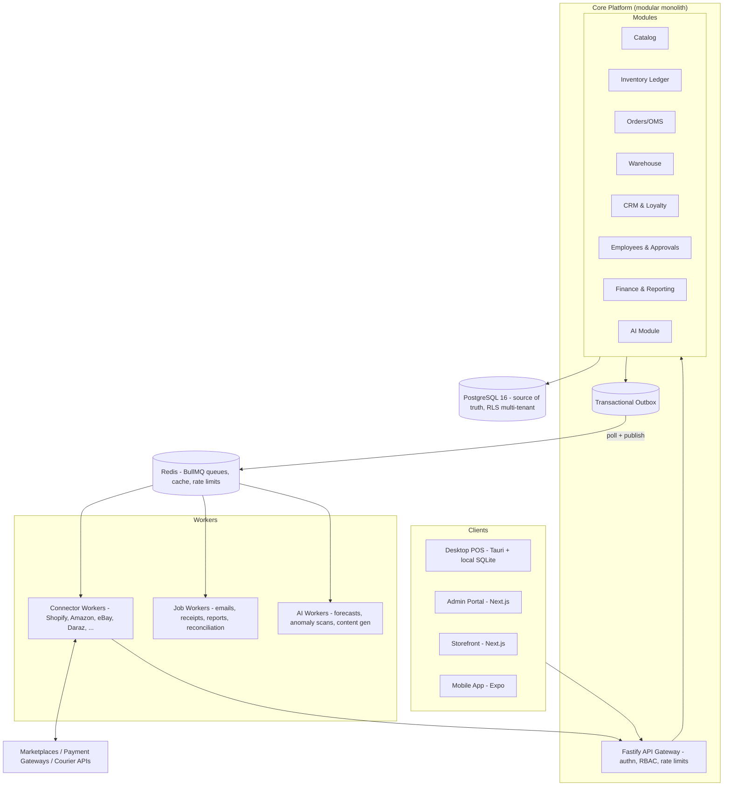

# System Architecture

## 1. Overview

OmniRetail OS is a **modular monolith** (TypeScript/Node.js, Fastify) over **PostgreSQL**,
with **Redis + BullMQ** for background jobs, a **transactional outbox** for domain events,
and independent **connector workers** for marketplace sync. Clients: Next.js admin portal,
Next.js storefront, Tauri desktop POS (offline-first), Expo mobile companion.



## 2. Module boundaries

Each module owns its tables and exposes a TypeScript service interface; cross-module calls
go through those interfaces (enforced by lint rules on import paths), never through another
module's tables. This is what makes later service extraction possible.

| Module | Owns | Emits events |
| --- | --- | --- |
| Catalog | products, variants, categories, brands, price lists | `product.updated`, `price.changed` |
| Inventory | stock movements, stock levels, serialized units, reservations, adjustments, counts | `inventory.level.changed`, `unit.state.changed` |
| Orders | orders (all channels), fulfillments, payments, refunds, invoices | `order.created`, `order.fulfilled`, `refund.approved` |
| Warehouse | locations, zones/bins, transfers, picks, receipts | `transfer.dispatched`, `receipt.posted` |
| CRM | customers, loyalty accounts, tickets | `customer.created` |
| Employees | users, roles, devices, shifts, approvals, audit log | `approval.requested`, `exception.flagged` |
| Finance | journals, tax, cash sessions, reports | `cash_session.closed` |
| AI | forecasts, suggestions, generated content | `suggestion.created` |
| Channels | connector registry, channel listings, sync state | `channel.order.imported`, `sync.drifted` |

## 3. The inventory ledger (heart of the system)

Stock is never a mutable counter. Every change is a `stock_movement` row — an atomic,
append-only posting that moves quantity between **stock buckets**:

```
bucket = (tenant, location, variant [, serialized unit]) × state
states: ON_HAND | RESERVED | IN_TRANSIT | DAMAGED | RETURNED_PENDING | LOST_WRITTEN_OFF
```

Rules (enforced in `packages/domain`, re-enforced by DB constraints):

1. A movement has a **type** (RECEIPT, SALE, RETURN, TRANSFER_OUT, TRANSFER_IN, ADJUSTMENT,
   RESERVATION, RELEASE, WRITE_OFF, COUNT_CORRECTION), a source bucket and/or destination
   bucket, a quantity > 0, an actor (user + device), a timestamp, and a **reference**
   (order id, transfer id, count id, approval id — adjustments *require* an approval ref).
2. `available = on_hand − reserved`. Availability is computed, never stored authoritatively;
   a materialized `stock_level` table is maintained transactionally with movements purely
   as a read-optimization and is verifiable by replaying the ledger (drift check job).
3. Serialized items (phones): quantity is always 1 per unit; the unit has its own state
   machine (`IN_STOCK → RESERVED → SOLD → RETURNED → …`) and a globally unique IMEI per
   tenant enforced by a partial unique index.
4. Negative on-hand is rejected at posting time (and by a DB `CHECK` on the level table),
   except in explicitly-configured "allow oversell" channels which instead create a
   backorder record.
5. Movements are immutable. Corrections are compensating movements, never updates.

This gives fraud prevention (nothing moves silently — see
[security/02-fraud-prevention-controls.md](security/02-fraud-prevention-controls.md)),
audit (full replay), and sync (the ledger sequence number is the cursor connectors and POS
devices sync from).

## 4. Multi-tenancy

Single database, shared schema, `tenant_id` on every row, **PostgreSQL row-level security**
keyed on `current_setting('app.tenant_id')` set per connection at checkout from the pool.
Rationale and rejected alternatives in [ADR-008](adr/ADR-008-multi-tenancy.md). Largest
tenants can later be moved to dedicated databases without schema changes.

## 5. Eventing: transactional outbox

Domain events are written to the `outbox` table **in the same transaction** as the state
change, then relayed to BullMQ by a poller (`FOR UPDATE SKIP LOCKED`, batched, ordered per
aggregate). Consumers are idempotent (event ids are dedupe keys). This guarantees no lost
or phantom events without distributed transactions. Kafka is deliberately deferred
([ADR-006](adr/ADR-006-outbox-and-jobs.md)).

## 6. Offline-first POS sync

- POS holds a local SQLite mirror of catalog + prices + its store's stock levels, refreshed
  by ledger-sequence cursor.
- Sales are written locally as an append-only **command log** with client-generated UUIDv7
  ids, then replayed to the server when online. Replay is idempotent (server dedupes on
  command id).
- Conflicts (e.g., two offline registers sell the last unit) are resolved by policy:
  first replay wins the stock; the second sale still stands financially but raises a
  negative-stock exception for manager resolution — the ledger records exactly what
  happened. Serialized items can't double-sell silently: the second IMEI sale is flagged
  at replay.
- Offline mode never includes: refunds above threshold, price overrides beyond cashier
  band, or new-customer credit — those require online approval workflows.

## 7. Deployment

- **Dev:** docker-compose (Postgres, Redis, API, workers, admin).
- **Prod v1:** containerized on a managed platform (e.g., Fly.io/Render/ECS) — API (N
  replicas, stateless), worker pool, Postgres (managed, PITR/WAL archiving, RPO ≤ 5 min),
  Redis (managed). CDN in front of storefront/admin static assets.
- **Scale path:** extract connector workers and AI workers first (they're already
  queue-isolated), read replicas for analytics, then per-module extraction guided by the
  event contracts. Kubernetes only when operational load justifies it.

## 8. Cross-cutting

- **AuthN/Z:** short-lived JWT access tokens + rotating refresh tokens; device-bound tokens
  for POS; RBAC permission strings checked at route + service layer; MFA (TOTP) for
  admin/manager roles. Details in [security/01-security-architecture.md](security/01-security-architecture.md).
- **Observability:** structured logs (pino) with tenant/user/request ids, OpenTelemetry
  traces, RED metrics per module, sync-lag and ledger-drift gauges as first-class SLIs.
- **API:** REST + OpenAPI generated from Zod schemas (single source for validation, types,
  and docs). Webhooks out to tenants with signed payloads.
- **AI:** all model calls go through one internal AI gateway module (provider = Claude API)
  with per-tenant budgets, prompt/version logging, and PII redaction before egress.

## 9. Performance targets (v1)

| Operation | Target |
| --- | --- |
| POS local product lookup / add-to-cart | p95 < 100 ms (local SQLite) |
| POS sale commit (online) | p95 < 400 ms end-to-end |
| Inventory movement post (API) | p95 < 150 ms |
| Channel inventory propagation | p95 < 30 s event-to-marketplace-call |
| Admin dashboard initial load | p95 < 2 s |
| Full-text product search (10⁶ SKUs) | p95 < 200 ms (Postgres FTS; Meilisearch when needed) |
