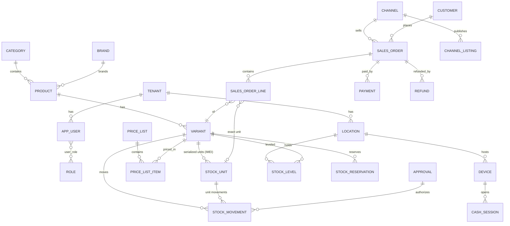

# Database Schema

Authoritative DDL lives in [`packages/db/sql/`](../packages/db/sql) (applied in order).
This document is the narrative + ER view. PostgreSQL 16; every tenant-owned table has
`tenant_id` + a forced RLS policy on `current_setting('app.tenant_id')` (ADR-008).

## Design rules

- **Money:** `bigint` minor units + `char(3)` currency. **Quantities:** `numeric(14,3)`.
- **Ledger:** `stock_movement` is append-only (DB trigger rejects UPDATE/DELETE);
  `stock_level` is a transactionally-maintained read model with `CHECK (quantity >= 0)`.
- **Ids:** UUIDs; rows born on clients (POS orders, movements) use client-generated
  UUIDv7 so replay is idempotent. `stock_movement.seq` / `outbox.sequence` are the sync cursors.
- **Enforced fraud controls:** adjustments/write-offs require `approval_id` (trigger);
  approvals forbid self-approval (`CHECK`); POS orders require cashier + device (trigger);
  `audit_log` is immutable and hash-chained.
- **IMEI uniqueness:** partial unique indexes on `(tenant_id, imei1)` / `(tenant_id, imei2)`.

## ER overview (core)

## Migration files

| File | Contents |
| --- | --- |
| `001_foundation.sql` | extensions, `tenant`, users/roles/permissions, `device`, hash-chained immutable `audit_log`, transactional `outbox`, RLS pattern |
| `002_catalog.sql` | `location`, `category`, `brand`, `supplier`, `product` (tracking: none/batch/serialized), `variant` (SKU/barcode/price), images, price lists |
| `003_inventory.sql` | `stock_unit` (IMEI uniqueness, unit state machine), `stock_movement` ledger (immutable, approval-gated adjustments), `stock_level` read model, `stock_reservation` (TTL), `approval`, transfers, counts |
| `004_orders.sql` | `customer`, `channel` (+connector config), `sales_order` (all channels, POS attribution trigger), lines (exact `stock_unit` per serialized sale), `payment` (tokenized refs only — no PANs), `refund` (approval-gated), `cash_session` (blind reconciliation), `channel_listing` (per-channel buffer + sync cursor) |

Planned next migrations: purchasing (`purchase_order`, receiving), WMS (zones/bins/picks),
loyalty transactions, finance journals, AI artifacts (forecasts/suggestions), notifications.

## Why levels are derived, not authoritative

`stock_level` exists purely so availability reads are O(1). The poster updates it in the
same transaction as the movement insert; a scheduled **drift check** replays the ledger per
variant and alarms on any mismatch — a mismatch means a code bug, never "shrinkage",
because stock cannot change without a movement row. See ADR-002.
